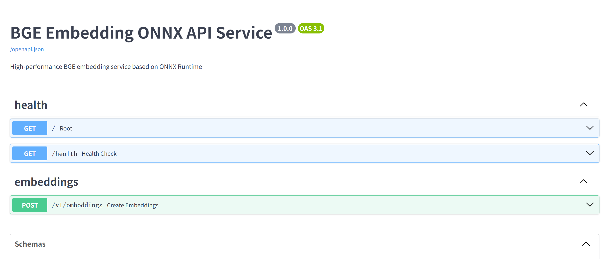

# BGE Embedding ONNX FastAPI Service

基于 BGE (BAAI General Embedding) 模型构建的高性能文本向量化服务，使用 FastAPI 提供 RESTful 接口，支持 ONNX模型的转换和推理加速。




## 特性

-  **OpenAI 兼容**: 完全兼容 OpenAI Embeddings API 标准接口，可直接替换使用
-  **高性能**: 基于 ONNX Runtime，支持 CPU/GPU 加速
-  **易于部署**: 提供 Docker 支持，一键部署
-  **灵活配置**: 支持环境变量配置，适应不同场景
-  **批量处理**: 支持单文本和批量文本处理
-  **模型转换**: 提供工具将 HuggingFace 模型转换为 ONNX 格式
-  **完整文档**: 详细的 API 文档和使用指南

## 项目结构

```
bge_embedding_onnx/
├── app/                    # 应用主目录
│   ├── api/               # API路由
│   │   ├── endpoints/    # API端点
│   │   └── routes.py      # 路由注册
│   ├── core/              # 核心模块
│   │   ├── config.py      # 配置管理
│   │   ├── exceptions.py  # 异常处理
│   │   ├── lifespan.py    # 生命周期管理
│   │   ├── logging_config.py  # 日志配置
│   │   └── middleware.py  # 中间件
│   ├── models/            # 数据模型
│   │   └── schemas.py     # Pydantic模型
│   ├── services/          # 业务逻辑
│   │   └── embedding_service.py  # Embedding服务
│   ├── utils/             # 工具函数
│   │   └── token_utils.py # Token处理工具
│   └── main.py            # FastAPI应用入口
├── scripts/               # 脚本目录
│   ├── convert_to_onnx.py # 模型转换脚本
│   └── test_embedding.py  # 测试脚本
├── docs/                  # 文档目录
├── logs/                  # 日志目录
├── Dockerfile             # Docker镜像构建文件
├── docker-compose.yml     # Docker Compose配置
├── requirements.txt       # Python依赖
├── run.py                 # 启动脚本
└── README.md              # 项目文档
```

## 快速开始

### 1. 环境要求

- Python 3.11+
- ONNX Runtime 1.20.1+
- 模型文件（ONNX格式）和 Tokenizer 文件

### 2. 安装依赖

```bash
# 创建虚拟环境（推荐）
python -m venv venv
venv\Scripts\activate  # Windows
# source venv/bin/activate  # Linux/Mac

# 安装依赖
pip install -r requirements.txt
```

### 3. 模型准备

#### 方式一：使用已有ONNX模型

如果你已经有ONNX模型文件，只需确保：
- ONNX模型文件：`bge-large-zh-v1.5.onnx`
- Tokenizer目录：包含 `tokenizer.json`, `tokenizer_config.json` 等文件

#### 方式二：从HuggingFace模型转换

使用提供的转换脚本将HuggingFace模型转换为ONNX格式：

```bash
python scripts/convert_to_onnx.py \
    --model_path D:\backup\models\BAAI\bge-large-zh-v1.5 \
    --output_path bge-large-zh-v1.5.onnx \
    --opset_version 13 \
    --max_length 512
```

**参数说明：**
- `--model_path`: HuggingFace模型路径
- `--output_path`: 输出的ONNX文件路径
- `--opset_version`: ONNX opset版本（默认: 13）
- `--max_length`: 最大序列长度（默认: 512）

**转换完成后：**
- ONNX文件：`bge-large-zh-v1.5.onnx`
- Tokenizer文件：保留原始模型目录中的tokenizer相关文件

### 4. 配置环境变量

```bash
# 模型配置
BGE_MODEL_PATH=bge-large-zh-v1.5.onnx
BGE_TOKENIZER_PATH=D:\backup\models\BAAI\bge-large-zh-v1.5

# 服务配置
BGE_HOST=0.0.0.0
BGE_PORT=8080
BGE_LOG_LEVEL=INFO

# 批量处理配置
BGE_MAX_BATCH_SIZE=32
BGE_MAX_BATCH_SIZE_ALL=256
```

### 5. 启动服务

#### 开发环境（使用 uvicorn）

```bash
python run.py
```

#### 生产环境（使用 gunicorn）

```bash
gunicorn -w 4 -k uvicorn.workers.UvicornWorker \
    --bind 0.0.0.0:8080 \
    --timeout 300 \
    app.main:app
```

### 6. 测试服务

```bash
# 访问Swagger文档
http://localhost:8080/docs
```

## Docker 部署

### 1. 构建镜像

```bash
docker build -t bge-embedding:latest .
```

### 2. 运行容器

```bash
docker run -d \
    -p 8080:8080 \
    -v $(pwd)/models:/app/models:ro \
    -v $(pwd)/logs:/app/logs \
    -e BGE_MODEL_PATH=/app/models/bge-large-zh-v1.5.onnx \
    -e BGE_TOKENIZER_PATH=/app/models/bge-large-zh-v1.5 \
    bge-embedding:latest
```

### 3. 使用 Docker Compose

```bash
# 确保模型文件在 ./models 目录下
docker-compose up -d
```

## OpenAI 兼容性

本项目完全兼容 **OpenAI Embeddings API** 标准接口，可以直接替换 OpenAI 的嵌入服务使用。

### OpenAI 官方文档

OpenAI Embeddings API 的官方文档地址：
- **英文文档**: https://platform.openai.com/docs/api-reference/embeddings
- **API 参考**: https://platform.openai.com/docs/api-reference/embeddings/create

### 兼容性说明

本项目实现了与 OpenAI 完全兼容的接口规范：

| 特性 | OpenAI 标准 | 本项目支持 | 说明 |
|------|------------|-----------|------|
| 接口路径 | `POST /v1/embeddings` | ✅ | 完全兼容 |
| 请求参数 `input` | `string` 或 `array of strings` | ✅ | 支持单个文本或文本数组 |
| 请求参数 `model` | `string` | ✅ | 模型标识符 |
| 请求参数 `encoding_format` | `"float"` 或 `"base64"` | ✅ | 支持 `base64` 格式（默认返回 `float` 数组） |
| 请求参数 `dimensions` | `integer` | ✅ | 兼容 OpenAI API，但 BGE 模型不支持动态维度调整 |
| 请求参数 `user` | `string` | ✅ | 用户标识符，用于监控和检测滥用 |
| 响应格式 `object` | `"list"` | ✅ | 完全兼容 |
| 响应格式 `data` | `array of embedding objects` | ✅ | 完全兼容 |
| 响应格式 `usage` | `prompt_tokens`, `total_tokens` | ✅ | 完全兼容 |

### 使用方式

你可以像使用 OpenAI API 一样使用本服务，只需将 API 地址替换为本服务的地址：

**OpenAI 方式：**
```python
import openai

openai.api_base = "http://localhost:8080"  # 替换为你的服务地址
openai.api_key = "not-needed"  # 本服务不需要 API Key

response = openai.Embedding.create(
    input="这是一个测试文本",
    model="bge-large-zh-v1.5"
)
embedding = response['data'][0]['embedding']
```

**直接 HTTP 请求：**
```python
import requests

response = requests.post(
    "http://localhost:8080/v1/embeddings",
    json={
        "input": "这是一个测试文本",
        "model": "bge-large-zh-v1.5"
    }
)
result = response.json()
embedding = result["data"][0]["embedding"]
```

### 与 OpenAI 的差异

1. **模型名称**: 使用 `bge-large-zh-v1.5` 替代 OpenAI 的模型名称
2. **无需 API Key**: 本服务不需要认证，可直接使用
3. **维度限制**: `dimensions` 参数仅用于兼容 OpenAI API，BGE 模型不支持动态维度调整，将使用模型默认维度
4. **中文优化**: 使用 BGE 模型，对中文文本有更好的支持

## API 文档

### 1. 健康检查

```bash
GET /health
```

响应示例：
```json
{
  "status": "healthy",
  "model": "bge-large-zh-v1.5",
  "model_version": "1.5",
  "providers": ["CPUExecutionProvider"],
  "environment": "production"
}
```

### 2. 创建 Embeddings（兼容 OpenAI API）

```bash
POST /v1/embeddings
```

**请求参数：**

| 参数 | 类型 | 必填 | 说明 |
|------|------|------|------|
| `input` | `string` 或 `array of strings` | 是 | 要嵌入的输入文本。可以是单个字符串或字符串数组（批量处理） |
| `model` | `string` | 否 | 模型标识符，默认为 `"bge-large-zh-v1.5"` |
| `encoding_format` | `string` | 否 | 返回嵌入的格式。可选值：`"float"`（默认，返回 float 数组）或 `"base64"` |
| `dimensions` | `integer` | 否 | 结果嵌入的维度数。注意：BGE 模型不支持动态维度调整，此参数仅用于兼容 OpenAI API，实际将使用模型默认维度 |
| `user` | `string` | 否 | 表示终端用户的唯一标识符，用于监控和检测滥用 |

**请求示例：**

单个文本：
```json
{
  "input": "这是一个测试文本",
  "model": "bge-large-zh-v1.5",
  "encoding_format": null
}
```

批量文本：
```json
{
  "input": [
    "文本1",
    "文本2",
    "文本3"
  ],
  "model": "bge-large-zh-v1.5"
}
```

Base64 编码格式：
```json
{
  "input": "这是一个测试文本",
  "model": "bge-large-zh-v1.5",
  "encoding_format": "base64"
}
```

**响应格式：**

| 字段 | 类型 | 说明 |
|------|------|------|
| `object` | `string` | 固定值 `"list"` |
| `data` | `array` | 嵌入数据数组 |
| `data[].object` | `string` | 固定值 `"embedding"` |
| `data[].index` | `integer` | 嵌入在数组中的索引 |
| `data[].embedding` | `array` 或 `string` | 嵌入向量（float 数组或 base64 编码字符串） |
| `model` | `string` | 使用的模型标识符 |
| `usage.prompt_tokens` | `integer` | 输入的 token 数量 |
| `usage.total_tokens` | `integer` | 总 token 数量 |

**响应示例：**

```json
{
  "object": "list",
  "data": [
    {
      "object": "embedding",
      "index": 0,
      "embedding": [0.1, 0.2, 0.3, ...]
    }
  ],
  "model": "bge-large-zh-v1.5",
  "usage": {
    "prompt_tokens": 10,
    "total_tokens": 10
  }
}
```


## 使用示例

### Python 示例

```python
import requests

# 单个文本
response = requests.post(
    "http://localhost:8080/v1/embeddings",
    json={
        "input": "这是一个测试文本",
        "model": "bge-large-zh-v1.5"
    }
)
result = response.json()
embedding = result["data"][0]["embedding"]

# 批量文本
response = requests.post(
    "http://localhost:8080/v1/embeddings",
    json={
        "input": ["文本1", "文本2", "文本3"],
        "model": "bge-large-zh-v1.5"
    }
)
result = response.json()
embeddings = [item["embedding"] for item in result["data"]]
```

### JavaScript 示例

```javascript
// 使用fetch API
async function getEmbedding(text) {
    const response = await fetch('http://localhost:8080/v1/embeddings', {
        method: 'POST',
        headers: {
            'Content-Type': 'application/json',
        },
        body: JSON.stringify({
            input: text,
            model: 'bge-large-zh-v1.5'
        })
    });
    
    const result = await response.json();
    return result.data[0].embedding;
}
```

## 配置说明

### 环境变量

| 变量名 | 说明 | 默认值 |
|--------|------|--------|
| `BGE_MODEL_PATH` | ONNX模型文件路径 | `bge-large-zh-v1.5.onnx` |
| `BGE_TOKENIZER_PATH` | Tokenizer目录路径 | - |
| `BGE_HOST` | 服务监听地址 | `0.0.0.0` |
| `BGE_PORT` | 服务端口 | `8080` |
| `BGE_MAX_BATCH_SIZE` | 单次处理最大批量大小 | `32` |
| `BGE_MAX_BATCH_SIZE_ALL` | 总最大批量大小 | `256` |
| `BGE_MAX_SEQUENCE_LENGTH` | 最大序列长度 | `512` |
| `BGE_LOG_LEVEL` | 日志级别 | `INFO` |

## 性能优化

### GPU 加速

如果系统支持 GPU，ONNX Runtime 会自动使用 GPU 加速：

- **CUDA**: 自动检测并使用 `CUDAExecutionProvider`
- **ROCM**: 自动检测并使用 `ROCMExecutionProvider`

### 批量处理优化

- 单次请求批量大小建议不超过 `MAX_BATCH_SIZE`（默认32）
- 超过限制的请求会自动拆分为多个子批次处理
- 总批量大小限制为 `MAX_BATCH_SIZE_ALL`（默认256）


## 故障排除

### 常见问题

1. **模型加载失败**
   - 检查模型文件路径是否正确
   - 确认 tokenizer 目录存在且包含必要文件
   - 查看日志获取详细错误信息

2. **GPU 不可用**
   - 确认 GPU 驱动正确安装
   - 查看日志中的 providers 信息

3. **内存不足**
   - 减小 `MAX_BATCH_SIZE` 配置
   - 减少 `EXECUTOR_WORKERS` 数量

## 许可证

本项目基于 MIT 许可证开源。

## 贡献

欢迎提交 Issue 和 Pull Request 来改进这个项目。

## 参考资源

- [BGE Model](https://github.com/FlagOpen/FlagEmbedding)
- [ONNX Runtime](https://onnxruntime.ai/)
- [FastAPI](https://fastapi.tiangolo.com/)

